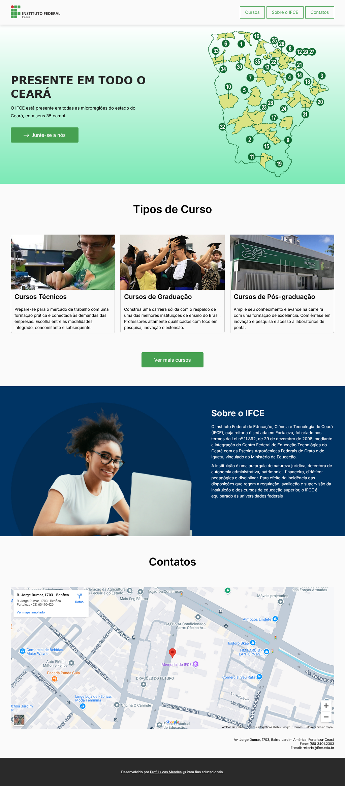

# Atividade Prática 07: Página institucional para o IFCE

> Nesta atividade vamos trabalhar os conceitos de cores, backgrounds, box-model, flexbox, tipografia, imagens, espaçamentos, animações, entre outros assuntos da disciplina.

- [Acesse aqui](./../../materiais/slides/) os materiais trabalhados em aula.
- [Acesse aqui](https://www.w3schools.com/) o site W3School.
- [Acesse aqui](https://developer.mozilla.org/pt-BR/) o site MDN Web Docs.
- [Acesse aqui](https://codepen.io/collection/rxRBoW) a coleção de exemplos práticos trabalhados em aula e disponibilizados no CodePen.

## Observações e Instruções para Realização da Atividade

- Você deve tentar replicar o resultado abaixo:
    > - ✅ Não precisa ficar exatamente igual. Você tem a liberdade de repensar o design e propor mudanças.
    > - 🚨 Mas fica ligado, que ao final deste documento eu especifico requisitos que devem ser sequidos.

---

    

---

- Acesse o vídeo de demonstração para observar e entender qual o comportamento e as microinterações esperadas:
    - Link para o vídeo de demonstração: https://drive.google.com/file/d/1GqSxRxrf03e9h-K86IVrQwL505r__K44/view?usp=sharing

---

### Requisitos e Dicas

- Você pode encontrar as imagens a serem utilizadas na pasta [img-instrucoes](./img-instrucoes/img/).

- Replique o efeito de sombra na parte inferior da barra de nevegação, como apresentado na imagem acima, ou defina algum outro efeito de destaque da barra de navegação.

- A seção inicial da página (CTA) tem como background um gradiente linear.

- Aplique um efeito consistente com o pseudo-seletor `:hover` nos menus e no botão de CTA, com o objetivo de destacar o elemento quando o usuário passar o mouse por cima, possibilitando fácil identificação do elemento selecionado e para deixar claro que aquele elemento é um alvo de ação.

- No botão de CTA ("Junte-se a nós"), perceba que foi aplicada uma animação ao símbolo de seta. Tente replicar esse efeito. Veja abaixo a indicação de conteúdos sobre animações:
    - MDN Web Docs: https://developer.mozilla.org/pt-BR/docs/Web/CSS/CSS_animations/Using_CSS_animations
    - Alura: https://www.alura.com.br/artigos/animacoes-em-css#animacoes-em-css
    - Desenvolvimento para Web: https://youtu.be/eTELLTacg-8?si=ZVswd0blrDW8nyIA
    - Meus vídeos no TikTok sobre animações:
        - https://www.tiktok.com/@prof_lucasmendes/video/7457759870033431813
        - https://www.tiktok.com/@prof_lucasmendes/video/7461793694002203909

- Defina uma largura máxima para os contêineres (área de navegação e seção inicial) de 1.024px, por exemplo (pode testar outro tamanho).

- Utilize alguma ferramenta de seleção de cores para auxilixar na identificação das cores utilizadas. Por exemplo, a ferramenta [Adobe Color](https://color.adobe.com/pt/create/image).

- Trabalhe com as propriedades de posicionamento, box-model e flexbox aprendidas em aula para definir as posições, espaçamentos e distribuição dos elementos do layout.
    - Além do material sobre flexbox da disciplina, disponibilizado no Classroom, aqui está um conteúdo muito bom sobre o assunto: https://origamid.com/projetos/flexbox-guia-completo/

- Vamos falar de tipografia?
    - Você deve definir uma hierarquia tipográfica adequada e harmônica, como no exemplo apresentado.
    - O alinhamento de textos mais longos na web geralmente é à esquerda (como já comentamos em aula).
    - Cuidado com os espaçamentos entre linha (`line-height`). Definir um espaçamento adequado, a depender do tamanho da fonte, é ideal para ter uma "área de respiro" no texto, ou para não deixar as linhas muito afastadas (em fontes maiores).
    - Veja esse conteúdo sensacional sobre tipografia na web: https://www.origamid.com/wp-content/themes/origamid_theme/uploads/tipografia-para-web.pdf