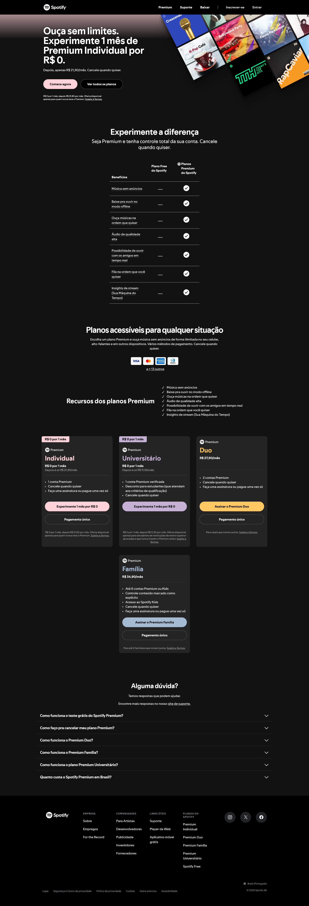
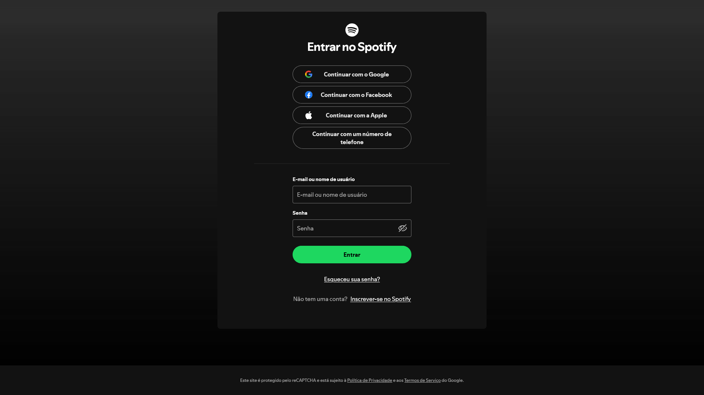

# Atividade Prática: Replicando as Páginas Inicial e de Login de um Serviço de Stream

> Nesta atividade, vamos colocar em prática vários conceitos trabalhados durante o semestre: **HTML semântico, box-model, flexbox, seletores CSS, transições, formulários, imagens, links, entre outros**. Seu desafio será **replicar** a página inicial de um serviço de stream e sua página de login.

- [Acesse aqui](https://www.w3schools.com/) o site W3Schools.
- [Acesse aqui](https://developer.mozilla.org/pt-BR/) o site MDN Web Docs.
- [Acesse aqui](./../../materiais/slides/) os materiais trabalhados em aula.

---

## Escolha uma das páginas abaixo para replicar

### **Netflix**

- Landing page da netflix

  

    
  

- Página de login da Netflix

  

    
  

  - [Clique aqui](./netflix/) para acessar as instruções específicas para a replicação das páginas acima, referente à Netflix.

### **Spotify**

- Landing page do Spotify

  

    
  

- Página de login do Spotify

  

    
  

  - [Clique aqui](./spotify/) para acessar as instruções específicas para a replicação das páginas acima, referente ao Spotify.

> **Obs.:** Não se preocupe em fazer uma **cópia exata**. O importante é replicar a **estrutura e os principais elementos** demonstrados. Você tem liberdade para **customizar** alguns detalhes, cores ou pequenas variações de layout.

---

