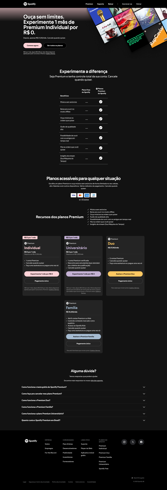
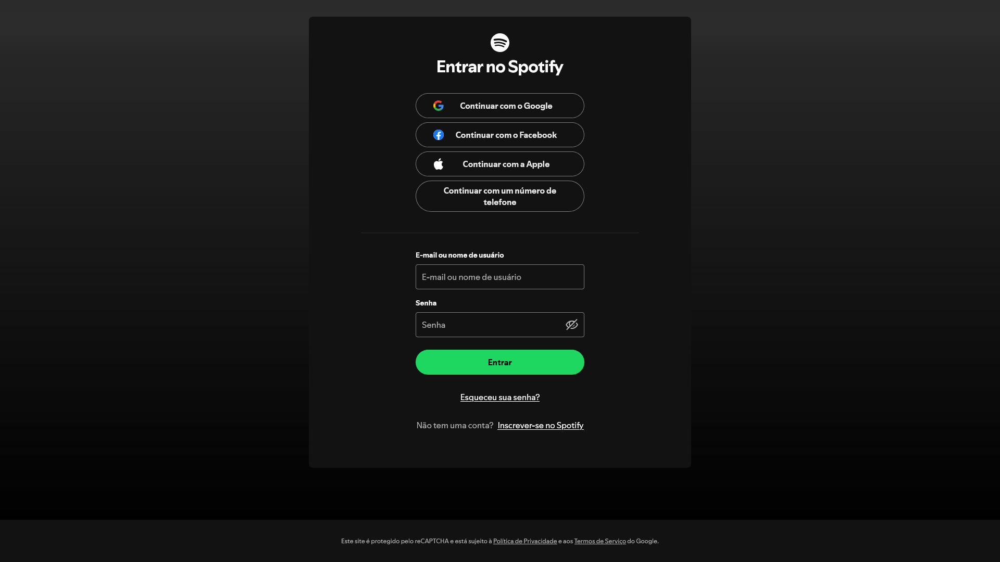

# **Replicação - Spotify**

- Landing page do Spotify

  <div align="center">
    
  </div>

- Página de login do Spotify

  <div align="center">
    
  </div>

- Vídeo demonstrativo: [acesse aqui](https://drive.google.com/file/d/1L_oSuaD_IjFggMrKSYpW2Jz8C4IxJcbG/view?usp=sharing)

- Imagens para utilizadas na página: [acesse aqui](./img/)

---

## Observações e Instruções para Realização da Atividade

> Nesta prática, você irá **replicar** a página inicial e página de login do Spotify (conforme imagens de referência fornecidas), aplicando os conceitos aprendidos em aula, como **HTML semântico, box-model, flexbox, seletores CSS, transições, formulários, imagens, links, entre outros**.

- **Estrutura Principal**:
  - **Cabeçalho de navegação**: Logotipo do Spotify, links para navegação (ex.: Premium, Suporte, Baixar, Inscrever-se, Entrar).
  - **Hero Section**: Grande destaque inicial, com o texto “Ouça sem limites”, chamada para planos Premium e imagem ou composição de imagens de álbuns.
  - **Seção “Experimente a diferença”**: Destaque de benefícios e vantagens do Spotify (qualidade de áudio, catálogos, podcasts etc.).
  - **Seção de “Planos acessíveis”**: Apresenta diferentes planos do Spotify (Individual, Universitário, Família, Duo).
  - **Seção de “Recursos dos planos Premium”**: Cards descrevendo detalhes de cada plano.
  - **Seção de FAQ (Perguntas Frequentes)**: Com itens que podem ser **expandidos/recolhidos** (accordion).
  - **Rodapé**: Links úteis (ex.: Suporte, Sobre, Privacidade, Cookies, Anúncios, etc.) e ícones de redes sociais.

- **Semântica**:
  - Utilize tags HTML semânticas, como `<header>`, `<main>`, `<section>`, `<article>`, `<footer>` e outras que julgar necessárias.

- **Estilização**:
  - Aplique conceitos de **box-model** para ajustar espaçamentos, bordas e margens.
  - Use **flexbox** para criar disposições horizontais e verticais de elementos, garantindo **responsividade** simples.
  - Explore **transições** e/ou **animações** em botões e menus para criar microinterações (ex.: mudança de cor ao passar o mouse, animação de foco no campo de formulário).
  - Defina uma **largura máxima** (por exemplo, `max-width: 1024px`) para centralizar o conteúdo e evitar linhas de texto muito longas.
  - Experimente **backgrounds** com imagens e/ou gradientes (principalmente no hero).

- **Responsividade** (opcional):
  - O layout deve se adaptar em **diferentes tamanhos de tela** (celulares, tablets, desktops).
  - Utilize **media queries** para ajustar o layout em breakpoints estratégicos.

- **Perguntas Frequentes (FAQ)**:
  - Crie um **accordion** com perguntas e respostas.
  - Ao clicar em uma pergunta, a resposta deve **expandir**. Ao clicar novamente, pode **recolher** a resposta (ou opte por manter apenas uma aberta por vez).
  - Você pode implementar esse comportamento usando **HTML + CSS + JavaScript** ou apenas CSS (com checkbox/label e pseudo-classes), conforme seu nível de conhecimento.

- **Dicas de Design**:
  - Se quiser identificar cores e tons usados no Spotify, utilize uma ferramenta de seleção de cor (ex.: [Adobe Color](https://color.adobe.com/pt/create/image)).
  - Atente à **legibilidade**: use tamanhos de fonte adequados, contraste de cor entre texto e fundo, e **line-height** confortável.
  - Mantenha uma **hierarquia tipográfica** coerente, definindo claramente títulos, subtítulos e textos de apoio.
  - Para os ícones, utilize uma biblioteca como a [Bootstrap Icons](https://icons.getbootstrap.com/), [Font Awesome](https://fontawesome.com/), [Material Icons (Google Fonts)](https://fonts.google.com/icons), [Hero Icons](https://heroicons.com/) ou outra de sua preferência.

---

## Requisitos e Dicas Extras

1. **HTML Semântico**  
   - Estruture seu código para que cada seção seja facilmente compreendida.
   - Utilize tags semânticas para cada área da página.

2. **Box Model e Flexbox**  
   - Garanta que os elementos estejam bem organizados e que o layout seja responsivo.  
   - Explore propriedades como `display: flex;`, `justify-content`, `align-items` e `flex-wrap`.

4. **Transições e Animações**  
   - Adicione transições nos botões e links para dar **feedback visual** ao usuário (por exemplo, mudança de cor, leve aumento de tamanho ou sublinhado ao passar o mouse).  
   - Se desejar, inclua pequenas animações em ícones ou imagens, mas lembre-se de manter a experiência suave.

5. **FAQ (Accordion)**  
   - Permita que o usuário abra e feche perguntas e respostas.  
   - Lembre-se de estruturar o HTML de forma clara (por exemplo, `<details>` e `<summary>` em HTML5, ou checkbox/label para uma solução apenas em CSS).
   
   - ***Dicas para Construir Accordions***

     - Os **accordions** são componentes de interface que exibem conteúdo de forma colapsada ou expandida, permitindo que o usuário revele ou oculte seções de texto, perguntas e respostas ou qualquer outro tipo de conteúdo. Abaixo estão algumas dicas e links úteis para ajudar na construção desses elementos:

	    1. Defina a Estrutura Básica do HTML
		
	        - Geralmente, cada “acordeão” contém um **título** (pergunta, por exemplo) e um **corpo** (resposta). Exemplo de estrutura semântica que pode ser utilizada: **com `<details>` e `<summary>`** (HTML5 nativo):

		   ```html
		   <details>
			 <summary>Pergunta 1</summary>
			 <p>Conteúdo da resposta 1.</p>
		   </details>

		   <details>
			 <summary>Pergunta 2</summary>
			 <p>Conteúdo da resposta 2.</p>
		   </details>
		   ```

	    2. Links úteis:

            - W3Schools: [How To Create an Accordion](https://www.w3schools.com/howto/howto_js_accordion.asp) (Exemplos de JavaScript e CSS para construir acordeões)
            - MDN Web Docs: [`<details> e <summary>`](https://developer.mozilla.org/pt-BR/docs/Web/HTML/Element/details) (Documentação oficial sobre como usar as tags HTML5 de acordeão nativo)
            - University of Illinois: [Accessibility Examples: ARIA Accordion](https://techservicesillinois.github.io/accessibility/aria-examples/accordion.html) (Exemplo de acordeão com padrão de acessibilidade ARIA)
            - CSS-Tricks: Building an Accordion Component with Only HTML and CSS (Demonstra como usar checkbox ou radio para controlar a abertura/fechamento)
            - A11Y Project: [Tools and Techniques to Create Accessible Accordion Components](https://www.a11y-collective.com/blog/accessible-accordion/) (Aborda práticas de acessibilidade para acordeões)

6. **Interligação entre a Página Inicial e a Página de Login**
   - É importante garantir uma **navegação fluída** entre as páginas do seu site. A página inicial deve conter um link claro que leve o usuário à página de login, facilitando o acesso à conta e melhorando a experiência do usuário.

   - **Exemplo Prático:**
      - Na sua página inicial (`index.html`), insira um link para a página de login:
        ```html
        <header>
          <!-- Outras partes do cabeçalho -->
          <nav>
            <ul>
              ...
              <li><a href="./pages/login.html">Entrar</a></li>
            </ul>
          </nav>
        </header>
        ```

7. **Responsividade** (opcional) 
   - Teste em telas menores para garantir que o conteúdo não fique “quebrado”.  
   - Use **media queries** para ajustar fontes, espaçamentos ou alinhamentos quando necessário.

8. **Boas Práticas de Código**  
   - Organize seu CSS em seções ou utilize arquivos separados (HTML e CSS), evitando duplicações.  
   - Mantenha nomes de classes e IDs significativos (ex.: `.hero-banner`, `.plans-section`, `.faq-section`, `.btn-principal` etc.).

---

## Entrega (Bônus na pontuação pela entrega no GitHub)

> 📌 Este passo é opcional, mas vale um bônus de 3 pontos na nota da atividade.

1. Crie um repositório no GitHub para a sua prática.
2. Faça *commits* frequentes, documentando seu progresso e as implementações.
3. No arquivo **README** do seu repositório, inclua:
   - Uma breve descrição da atividade.
   - Prints de tela ou GIFs mostrando o resultado final.
   - Qualquer instrução necessária para rodar o projeto localmente (se aplicável).

---

## Materiais de Apoio

- **W3Schools**:  
  - [Flexbox](https://www.w3schools.com/css/css3_flexbox.asp)  
  - [HTML Semântico](https://www.w3schools.com/html/html5_semantic_elements.asp)
- **MDN Web Docs**:  
  - [HTML Elements](https://developer.mozilla.org/pt-BR/docs/Web/HTML/Element)  
  - [CSS Transitions](https://developer.mozilla.org/pt-BR/docs/Web/CSS/CSS_Transitions/Using_CSS_transitions)  
  - [CSS Animations](https://developer.mozilla.org/pt-BR/docs/Web/CSS/CSS_Animations/Using_CSS_animations)
- **CodePen**: [Exemplos de práticas desenvolvidos em aula](https://codepen.io/collection/gPpavo)
- **Origamid**: [Flexbox - Guia Completo](https://origamid.com/projetos/flexbox-guia-completo/)
- **Ferramentas de cor**: [Adobe Color](https://color.adobe.com/pt/create/image)

---

## Considerações Finais

- Lembre-se de que o objetivo desta prática é **consolidar** o que foi visto em aula, **explorar** diferentes abordagens de layout, **exercitar** estilização e, principalmente, **experimentar**.
- Não há problema em **buscar referências** e **pesquisar**. O importante é ***praticar e aprender***.
