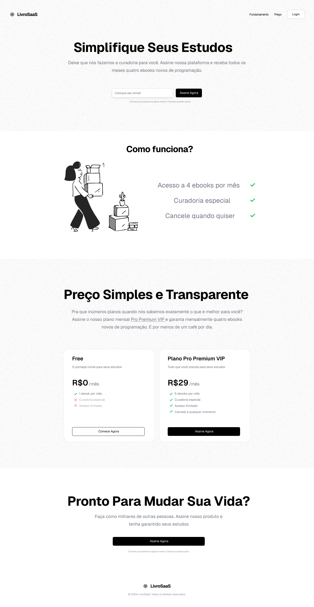
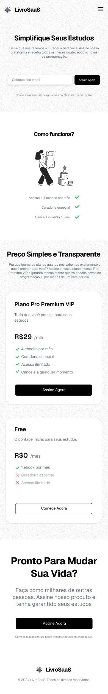
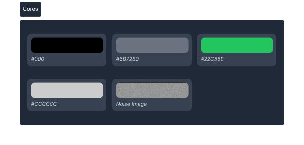
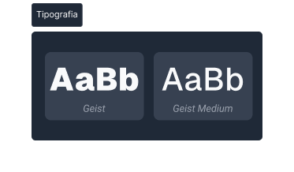

# Atividade Prática 09 - Projeto SaaS Landing Page

> Nesta prática, vocês deverão implementar, somente com HTML, CSS e JS (somente para a interação com o menu Hambúguer), a página apresentada abaixo. Vocês terão acesso ao design da página no Figma, tanto para a versão desktop como para a versão mobile.
> - O projeto se trata de uma landing page para um **SaaS (*Software as a Service*)** de assinatura de e-books.
> - O principal objetivo é praticar/explorar **técnicas de web design responsivo**.
> - Além disso, vocês irão aplicar diversos outros conhecimentos e técnicas aprendidos ao longo da disciplina.

## 🎨 Design do Projeto

O resultado final deve estar o mais próximo possível do design projetado e epresentado a seguir.

- 🖥️ Página na versão **Desktop**:

- 📱 Página na versão **Mobile**:

### Guia de Estilos

- 🖌️ Cores utilizadas:

    

- 🔡 Tipografia:

    

- 🖼️ Imagens:

    [Acesse aqui](./imgs/) as imagens utilizadas no design.

- 👨‍💻 Projeto no Figma:

    [Acesse aqui](https://www.figma.com/design/BdJp4YtJBRQmNy0lWN00Tk/%5BMini-projeto%5D-SaaS-Landing-Page?node-id=6410-853&t=0n0OoWPzMespjII8-1) o projeto de design da página no Figma. Por lá você poderá consultar outras informações e detalhes sobre as escolhas de design do projeto.

## 🎯 Requisitos e Instruções

### 🔷 Componentes

- **Navbar:** Implemente uma Navbar simples com:
    - Logotipo à esquerda.
    - Links de navegação (Funcionamento, Preço, Login) à direita.
    - Siga o design do Figma.

- **Seção Hero:** Crie a seção principal "Hero" com:
    - Título: "Simplifique Seus Estudos".
    - Subtítulo explicativo sobre a plataforma.
    - Campo de input para e-mail.
    - Botão de call to action (CTA) "Assine Agora".
    - Siga o design do Figma.

- **Seção "Como Funciona":** Explique o funcionamento em três etapas:
    - Acesso a 4 ebooks por mês.
    - Curadoria especial.
    - Cancelamento a qualquer momento.
    - Siga o design do Figma.

- **Seção de Preços:** Crie a seção de preços com destaque para o plano "Pro Premium VIP" (R$ 29/mês) incluindo:
    - 4 ebooks por mês.
    - Curadoria especial.
    - Acesso ilimitado.
    - Cancelamento a qualquer momento.
    - Siga o design do Figma.

- **Seção Final com CTA:** Incentive a assinatura com:
    - Título: "Pronto Para Mudar Sua Vida?".
    - Texto de suporte.
    - Botão de CTA.

- **Rodapé:** Implemente um rodapé simples com:
    - Logotipo da empresa.
    - Copyright e informações legais.

- **Design Responsivo:** Adapte o design para dispositivos móveis:
    - Crie um menu mobile (estilo menu Hambúrguer).
    - [Acesse aqui](https://codepen.io/prof_lucasmendes/pen/RNwZdXK) o exemplo de implementação de menu Hambúguer compartilhado anteriormente com vocês.
    - Siga o design do Figma.

### ⤵️ Responsividade

- Implemente o projeto seguindo o princípio [***Mobile First***](https://blog.apiki.com/mobile-first-o-conceito-e-sua-aplicabilidade/), ou seja, inicie pelo projeto de design para dispositivos móveis, só depois faça os ajustes necessários para a versão desktop da página.

- Ao acessar a página através de um dispositivo móvel, o usuário deve ter a possibilidade de expandir o menu de navegação através de um botãop do tipo "Hambúrguer". O menu de navegação expandido deve estar estilizado de forma harmônica com o design geral da página.

### ▶️ Aimações 

- Experimente criar animações e transições suaves, por exemplo, quando o usuário:
    - passar o mouse por cima de elementos interativos como os botões e itens de menu;
    - rolar a página, para aparecer os elementos abaixo de forma suave.
        - Veja meu vídeo sobre animação de scroll em CSS: https://www.tiktok.com/@prof_lucasmendes/video/7471496717381258501

### 📑 Organização do Código

- Siga a estrutura de organização sugerida pelo professor em sala de aula e utilizada na correção da nossa última prática ([acesse aqui](https://github.com/lucas-lfm/tweb-ads-base-2024.2/tree/main/atividades/atv08-lp-login/correcao-referencia) o código de referência).
    - Utilize um CSS reset, caso ache necessário ([CSS Reset do Meyer](https://meyerweb.com/eric/tools/css/reset/));
    - Separe os estilos CSS em arquivos distintos, caso o código fique muito extenso, ou organize de forma lógica o seu código em um único arquivo (use comentários se necessário).

- Use variáveis CSS para definir estilos globais para a página a fim de manter uma consistência maior.

- Mantenha o código bem indentado e com espaçamentos apropriados entre os blocos de código.

- Lembre-se de verificar seus códigos HTML e CSS nos validadores da W3C:
    - Validador HTML: https://validator.w3.org/
    - Validador CSS: https://jigsaw.w3.org/css-validator/

## 🚀 Dicas e Instruções Extras

- Siga o Design do Figma, mas fique à vontade para fazer pequenas modificações que julgar adequadas.

- Defina uma escala tipográfica adequada para manter uma boa hierarquia textual.
    - Defina tamanhos adequados e consistentes para os títulos e textos de apoio.

- Defina espaçamentos adequados para agrupar os elementos na página, mantendo "áreas de respiro" ([***white space***](https://www.eliascury.com.br/glossario/entenda-o-conceito-de-white-space-no-design/)) e proporcionando uma boa hierarquia visual.

- Prefira utilizar espaçamentos múltiplos de 8px, seguindo a metodologia [8-point grid](https://medium.com/design-bootcamp/designing-in-the-8pt-grid-system-f3c1183ea6e8).

- Use sombras sutis em alguns elementos, como os cards de preço, por exemplo.
    - Esse artigo aborda muito bem o papél do efeito de sombra em um design: https://jrbauru.com.br/glossario/uso-de-sombra-no-design/

- Cuidado com o contraste das cores utilizadas (caso modifique alguma cor ou use alguma variação de tonalidade).

## ❓ Dúvidas

- Qualquer dúvida que surgir, entre em contato comigo pelo Classroom (comentários particulares ou mesmo públicos no post da atividade).
    - Também pode entrar em contato pelo meu WhatsApp ou e-mail (lucas.mendes@ifce.edu.br).

## 🔁 Créditos

- Esta atividade é baseada no desafio de Front End ["Projeto SaaS Landing Page com Next.js e Shadcn UI"](https://codante.io/mini-projetos/saas-landing-page-com-nextjs-e-shadcn-ui) do site [codante.io](https://codante.io/).
