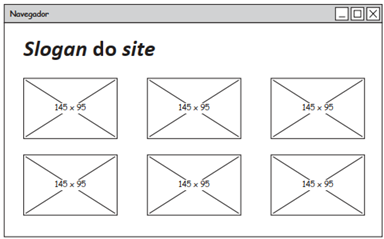
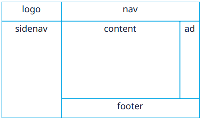
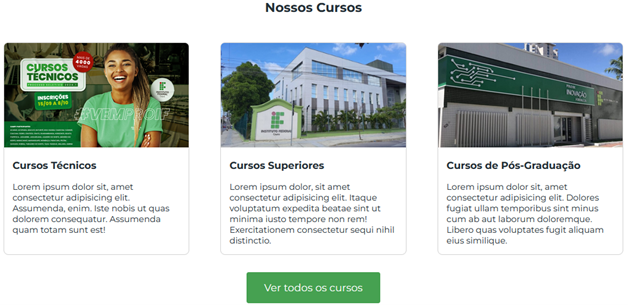

<table style="width: 100%; margin: 0 auto;">
    <tr>
        <td rowspan="2"></td>
        <td colspan="2" align="center"><b>INSTITUTO FEDERAL DE EDUCAÇÃO, CIÊNCIA E TECNOLOGIA DO CEARÁ - CAMPUS TAUÁ<br>
                        ANÁLISE E DESENVOLVIMENTO DE SISTEMAS</b>
        </td>
    </tr>
    <tr>
        <td><b>Professor:</b> Me. Lucas Mendes</td>
        <td><b>Disciplina:</b> Tecnologias Web<br>
            <b>Turma:</b> S1
        </td>
    </tr>
    <tr>
        <td colspan="3" align="center"><strong>Lista de Exercícios de Revisão - N2</strong></td>
    </tr>
</table>

---

### 1. Qual a principal diferença entre os modelos de cores RGB e CMYK?

a) O RGB é aditivo, enquanto o CMYK é subtrativo.  
b) O RGB utiliza pigmentos, enquanto o CMYK utiliza luz.  
c) O RGB é empregado em impressão e o CMYK em telas.  
d) Ambos são aditivos, mas o RGB possui mais cores e, por isso, é utilizado em telas.  
e) Nenhuma das alternativas anteriores.

---

### 2. Explique a diferença entre `justify-content` e `align-items` no Flexbox. Inclua um exemplo de código CSS para cada um.

---

### `Cara de Prova 😉 ▶️` 3. Explique a importância da teoria das cores e como o uso adequado das combinações de cores pode impactar a experiência do usuário em um site. Baseie sua resposta nos conceitos apresentados sobre cores e backgrounds.

---

### 4. Qual valor de `flex-direction` organiza os itens verticalmente, de baixo para cima?

a) `row`  
b) `column`  
c) `row-reverse`  
d) `column-reverse`  
e) `vertical`

---

### 5. Descreva três tipos de gradientes em CSS e suas sintaxes básicas.

---

### 6. Ao desenvolver um site que deve funcionar tanto em desktops quanto em dispositivos móveis, qual recurso CSS é mais indicado para adaptar o layout conforme o tamanho da tela?

a) Flexbox  
b) CSS Grid  
c) Media queries  
d) Animações  
e) Pseudo-classes

---

### 7. Qual pseudo-classe seleciona um elemento quando o usuário **clica** nele?

a) `:hover`  
b) `:active`  
c) `:focus`  
d) `:visited`  
e) `:checked`

---

### `Cara de Prova 😉 ▶️` 8. Imagine que você precisa ajustar o layout de uma página que utiliza Flexbox para diferentes dispositivos. Descreva como você pode empregar media queries para alterar a direção, o espaçamento ou a distribuição dos itens, e exemplifique uma situação prática em que essa abordagem melhora a usabilidade.

---

### 9. Qual propriedade CSS transforma um elemento em um flex container?

a) `flex: block;`  
b) `display: flex;`  
c) `display: grid;`  
d) `position: flex;`  
e) `float: flex;`

---

### 10. O que é **especificidade** em CSS? Calcule a especificidade do seletor `div#menu .item:hover`.

---

### 11. Qual **meta tag** é essencial para garantir a responsividade em dispositivos móveis?

a) `<meta charset="UTF-8">`  
b) `<meta name="description" content="...">`  
c) `<meta name="viewport" content="width=device-width, initial-scale=1.0">`  
d) `<meta http-equiv="X-UA-Compatible" content="IE=edge">`  
e) `<meta name="author" content="...">`

---

### 12. Crie um layout de 3 colunas com CSS Grid onde a coluna central ocupa o dobro do espaço das outras. Inclua o código CSS.

---

### 13. Qual valor de `flex-wrap` permite que os itens quebrem para uma nova linha reversa?

a) `nowrap`  
b) `wrap`  
c) `wrap-reverse`  
d) `reverse`  
e) `flex-flow`

---

### 14. Explique a diferença entre `position: relative` e `position: absolute`.

---

### 15. Explique os fundamentos do Flexbox, destacando suas principais propriedades (como `flex-direction`, `justify-content` e `align-items`) e como elas facilitam o alinhamento e a distribuição de espaço entre elementos em um layout.

---

### `Cara de Prova 😉 ▶️` 16. Como você aplicaria uma animação de rotação infinita a um elemento usando `@keyframes`?

---

### 17. Qual propriedade CSS é usada para alinhar um único item, horizontalmente, dentro de sua célula no Grid?

a) `align-content`  
b) `justify-self`  
c) `align-items`  
d) `place-items`  
e) `grid-area`

---

### `Cara de Prova 😉 ▶️` 18. Um portal de notícias precisa adaptar seu layout para dispositivos móveis. Atualmente, a página exibe as últimas notícias em 3 colunas usando CSS Grid. A equipe de UX solicitou que, em telas menores que 768px, o layout seja alterado para 1 coluna, garantindo melhor legibilidade e experiência do usuário. Além disso, é essencial manter a responsividade sem afetar o desempenho do site.



#### Probelema:

Qual código CSS deve ser implementado para cumprir esse requisito?

a)

```css
@media (max-width: 768px) {
  .container {
    display: block;
  }
}
```

b)

```css
@media (min-width: 768px) {
  .container {
    grid-template-columns: 1fr;
  }
}
```

c)

```css
@media (max-width: 768px) {
  .container {
    grid-template-columns: 1fr;
  }
}
```

d)

```css
.container {
  grid-template-columns: repeat(auto-fit, minmax(250px, 1fr));
}
```

e)

```css
@media (max-width: 768px) {
  .container {
    flex-direction: column;
  }
}
```

---

### 19. Qual seletor CSS seleciona todos os elementos `<p>` que são filhos diretos de `<div>`?

a) `div p`  
b) `div > p`  
c) `div + p`  
d) `div ~ p`  
e) `div.p`

---

### 20. Para estruturar uma página que contém header, sidebar, conteúdo principal e footer de maneira bidimensional, qual tecnologia CSS seria mais indicada?

a) Flexbox  
b) CSS Grid  
c) Float  
d) Display inline-block  
e) Position absolute

---

### 21. Qual propriedade CSS **não** é animável?

a) `opacity`  
b) `width`  
c) `display`  
d) `transform`  
e) `background-color`

---

### 22. Explique o conceito de **Mobile First** e como aplicá-lo usando media queries.

---

### `Cara de Prova 😉 ▶️` 23. Descreva um cenário real onde a combinação de CSS Grid e Flexbox seja vantajosa para criar um layout complexo e responsivo. Explique qual parte do layout você gerenciaria com cada tecnologia e os benefícios dessa integração.

---

### 24. Durante a implementação de um layout com CSS Grid, um aluno observa problemas de espaçamento entre as células. Qual propriedade é indicada para ajustar o espaçamento entre linhas e colunas?

a) `margin`  
b) `padding`  
c) `gap`  
d) `justify-content`  
e) `align-items`

---

### `Cara de Prova 😉 ▶️` 25. Apresente um exemplo prático de como utilizar a propriedade grid-template-areas para definir um layout que contenha áreas para logo, navegação, conteúdo e rodapé, como na imagem abaixo. Explique cada parte da configuração e como ela contribui para a organização visual do site.



---

### 26. Em relação à cascata CSS, qual das seguintes fontes de estilos possui a maior prioridade?

a) Folhas de estilo externas do autor  
b) Estilos embutidos no elemento (inline)  
c) Folhas de estilo internas (dentro do head)  
d) Folhas de estilo padrão do navegador  
e) Folhas de estilo do usuário

---

### 27. Se um elemento possui duas declarações de estilo conflitantes e uma delas utiliza `!important`, qual declaração será aplicada?

a) A declaração sem !important, se declarada por último  
b) A declaração com !important  
c) A declaração que utiliza o seletor mais específico  
d) Ambas são aplicadas, combinando os valores  
e) Nenhuma das anteriores

---

### `Cara de Prova 😉 ▶️` 28. Usando o flexbox podemos facilmente alinhar e posicionar elementos dentro de um contêiner. Dada a seção “Nossos Cursos”, implementada como na imagem abaixo, assinale a alternativa que apresenta a propriedade do flexbox que permite os cards serem posicionados na linha seguinte, caso o contêiner não possua espaço suficiente para apresentalos em uma mesa linha.



a) `justify-content: wrap`  
b) `flex-direction: column`  
c) `align-items: stretch`  
d) `flex-wrap: wrap`  
e) `wrap: column`

---

### `Cara de Prova 😉 ▶️` 29. Pseudo-elementos permitem estilizar, por exemplo, os marcadores de uma lista (`li::marker`), a primeira linha de uma parágrafo (`::first-line`), ou até mesmo criar elementos antes de (`::before`) ou após (`::after`) algum elemento selecionado.

**Nesse sentido, explique por que a afirmação a seguir não está correta, relacionando os conceitos de pseudo-seletores (especificamente pseudo-elementos) e Web semântica.**

_"O uso extensivo de pseudo-elementos do tipo `::after` e `::before` no CSS3 pode melhorar a estrutura semântica de um documento HTML."_
